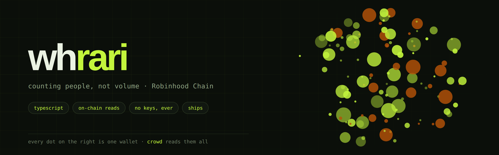

<p align="center">
  <a href="https://x.com/0xwhrrari"></a>
  <a href="https://github.com/0xwhrari?tab=repositories"></a>
  
  
</p>

---

### About

```ts
const whrari = {
  builds:  ["on-chain reads", "launch forensics", "terminals worth screenshotting"],
  writes:  ["typescript", "solidity", "whatever the chain answers in"],
  rules:   ["count, do not guess", "no keys, no signing, no trades",
            "say what a number does not mean"],
  now:     "crowd - how many people are actually in a launch",
  against: "scanners that score a launch and never tell you why",
};
```

Every scanner on this chain measures volume. Ten ETH from one wallet and ten ETH
from two hundred wallets draw the same candle and mean opposite things. Only one
of them is a crowd, and nobody was counting.

---

### Stack

<p>
  
  
  
  
  
  
</p>

No SDK, no viem, no ethers. Three RPC methods and arithmetic, because a
dependency you did not need is a dependency that breaks on a Tuesday.

---

### crowd

**How many people are actually in a Robinhood Chain launch.**

```bash
npx crowd read 0x67bbed4295aa98b0399160079eef7b43c7a38eb9
```

No install, no API key, no account. It reads the transfer log, works out which
address is the pool, and counts the distinct wallets on the other side of it.

```
  ┌ THE CROWD ─────────────────────────────────────────────────
  │ wallets bought                41  distinct addresses
  │ made this week                10  24% of the ages read
  │ have history                  31  76% of them
  │ already sold back              2  sent tokens to the pool

  ┌ VERDICT ───────────────────────────────────────────────────
  │ [ SPREAD ]
  │ 41 separate wallets, no single one over a third
```

Then it keeps a plain JSON file next to you. After ten reads that file starts
recognising wallets across launches. After a week it knows things nobody else's
file knows, because nobody else ran your reads.

<a href="https://github.com/0xwhrari/crowd"></a>
<a href="https://github.com/0xwhrari/crowd#readme"></a>

---

### What I work on

| | |
|---|---|
| **Head counts** | distinct wallets behind a launch, and how concentrated they are |
| **Wallet records** | who keeps showing up, and who actually got back out |
| **Launch forensics** | pool detection, fresh wallet detection, transfer log reads |
| **Terminals** | output narrow enough to paste into a post and still make sense |

---

### How I build

- **Count, do not guess.** Every figure comes from a log entry with a block
  number behind it, or the field says estimate.
- **Never say safe to buy.** The tool reports mechanisms. It does not certify.
- **No keys, no signing, no trades.** There is no code in any of these repos
  that could.
- **Degrade honestly.** If an endpoint refuses, say so and point somewhere that
  works. Never fake a result.
- **Say what it does not mean.** Forty wallets can still be one person. A spread
  costs more to fake than a single buy, which is why the number is useful. It is
  not proof of anything.

---

<sub>MIT on everything public. Ask before you build a paid product on it, or do
not, it is MIT.</sub>
