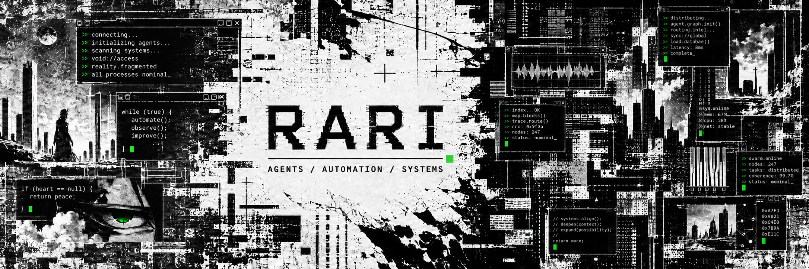
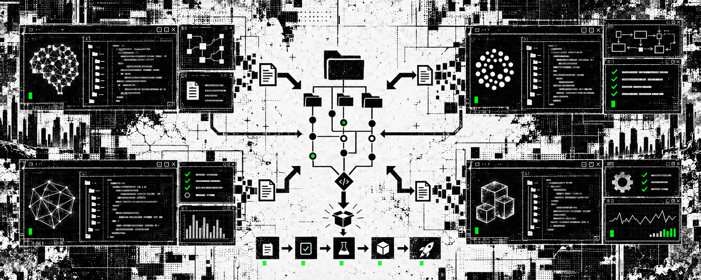

<div align="center">
  
</div>

<br />

<div align="center">
  <a href="https://github.com/0xwhrari">
    
  </a>
  <a href="https://x.com/0xwhrrari">
    
  </a>
  
</div>

<h3 align="center">independent developer building repositories for the AI ecosystem.</h3>

<p align="center">
  <samp>agents · automation · developer tools · bots · model integrations · terminal software</samp>
</p>

---

## `> whoami`

I'm **rari** — an independent developer building open-source repositories around AI models and coding agents.

I turn model capabilities into things developers can actually use: **skills, bots, agent workflows, CLI tools, integrations, reusable prompts, context systems and automation infrastructure**.

My work is aimed at ecosystems around **Claude**, **ChatGPT / Codex**, **Grok / Grokbot**, local models and whatever comes next. I am interested in the engineering surrounding the model: how it receives context, uses tools, remembers state, verifies work and ships a result.

> Models are replaceable. Good tooling, clear interfaces and reliable execution are not.

<br />

<div align="center">
  
</div>

## `> repository.types`

| Repository lane | What belongs there |
| :--- | :--- |
| **agent systems** | tool-using agents, planning loops, memory, context routing and orchestration |
| **coding workflows** | skills, rules, prompts and reusable project setups for AI coding agents |
| **bots & integrations** | Grokbot-style services, chat integrations, event-driven bots and background workers |
| **developer tooling** | terminal-first utilities, scaffolds, repo templates, debuggers and local dashboards |
| **model infrastructure** | provider adapters, MCP servers, eval harnesses, tracing and structured outputs |
| **experiments** | small focused repositories testing one mechanism without pretending to be a product |

## `> ecosystems`

<div align="center">
  
  
  
  
</div>

<br />

| Ecosystem | What I want to build around it |
| :--- | :--- |
| **Claude** | project workflows, agent roles, tool-use patterns and repository-level instructions |
| **ChatGPT / Codex** | reusable skills, coding automations, task pipelines and repo-native developer tools |
| **Grok / Grokbot** | real-time bots, social/data integrations, watchers and autonomous background services |
| **model-agnostic** | MCP tools, adapters, evaluations and infrastructure that survives provider changes |

<p align="center"><sub>Independent work — not affiliated with Anthropic, OpenAI, xAI or the products named above.</sub></p>

## `> build.queue`

The profile is early. The direction is not.

```text
[ BUILDING ]    reusable agent workflows and repository foundations
[ PROTOTYPING ] cross-model bots, tool adapters and automation primitives
[ RESEARCHING ] context, memory, verification and multi-agent coordination
[ SHIPPING ]    small focused repositories — one useful mechanism at a time
```

Planned repository themes:

- Claude and Codex workflow collections
- agent-ready repository templates
- Grokbot and event-driven bot foundations
- prompt, skill and tool registries
- MCP servers and provider adapters
- evaluation, tracing and debugging utilities
- terminal-first AI developer tools

## `> engineering.loop`

```text
observe → understand → prototype → connect tools → verify → document → ship
```

I prefer systems that expose what happened instead of hiding everything behind “AI magic.” Decisions should be inspectable, failures should be visible, and the boundary between model output and real execution should be explicit.

## `> working.stack`

<div align="center">
  
</div>

<br />

<div align="center">
  
  
  
  
  
  
</div>

<p align="center"><sub>The stack is a working set, not an identity. The problem chooses the tool.</sub></p>

## `> current.signal`

The only public build here right now is <a href="https://github.com/0xwhrari/SNIPE"><strong>SNIPE</strong></a> — an earlier terminal-first experiment for turning noisy real-time on-chain activity into explicit decisions.

It is a small part of the story. The next repositories move deeper into **AI agents, automation and developer infrastructure**.

## `> operating.principles`

<details>
  <summary><strong>expand protocol</strong></summary>
  <br />

```text
01. understand the mechanism before wrapping it
02. build the smallest version that proves something
03. keep state, tools and failure modes visible
04. verify what the agent actually changed
05. document the boundary between model and execution
06. ship the repository, then improve from reality
```

</details>

## `> github.signal`

<div align="center">
  
  
</div>

---

<p align="center">
  <samp>build the tool → expose the mechanism → automate the loop → ship the repository</samp>
</p>

<p align="center">
  <sub>quiet profile. loud repositories incoming.</sub>
</p>
