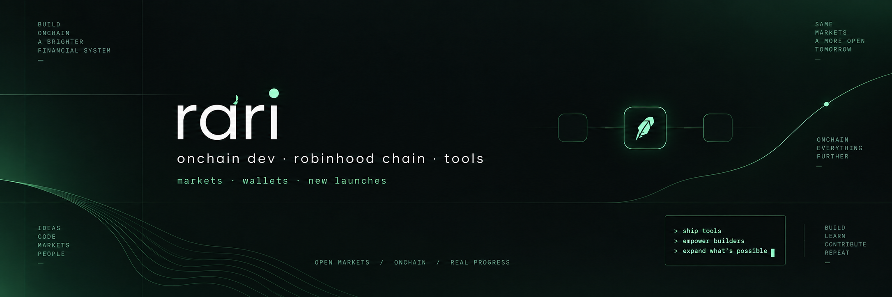
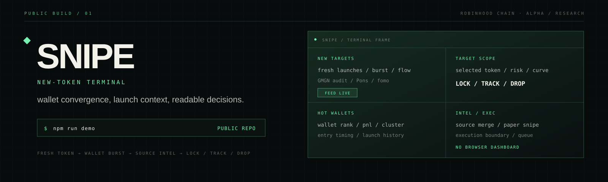
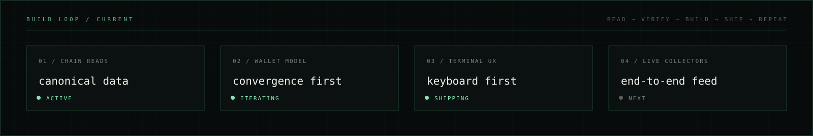

<p align="center">
  
</p>

<div align="center">
  <a href="https://x.com/0xwhrrari"></a>
  <a href="https://github.com/0xwhrari"></a>
  <a href="https://github.com/0xwhrari/SNIPE"></a>
  
</div>

<h3 align="center">building fast tools around new launches, wallets and onchain market data.</h3>
<p align="center"><sub>mostly interested in what happens <strong>before the chart gets obvious</strong>.</sub></p>

<br />

## experience snapshot

<p>
  
  
  
  
  
</p>

> I work where raw chain activity becomes a readable decision. The product is usually a terminal: fast enough for a moving feed and explicit about what each signal can and cannot prove.

Current focus: **SNIPE**, a keyboard-first new-token terminal built around wallet convergence, launch context and explainable `LOCK / TRACK / DROP` decisions.

<br />

## stack

<p align="center">
  
  
  
  
  
  
  
  
  
</p>

Small dependency surfaces, visible mechanisms and terminal output that stays readable while the feed moves.

<br />

## what I work on

| area | what it becomes |
|:--|:--|
| **launch discovery** | fresh tokens, Pons identity, curve state and early flow |
| **wallet convergence** | burst timing, tracked wallets, clusters and launch history |
| **risk context** | audit data, liquidity, concentration and deployer history |
| **terminal systems** | keyboard-first CLI / TUI interfaces, live feeds and explicit states |
| **Robinhood Chain** | canonical blocks, transfers, pools and raw RPC experiments |

<br />

## proof of work

- **Public alpha:** [`0xwhrari/SNIPE`](https://github.com/0xwhrari/SNIPE) is open under MIT and runs as a real local CLI / TUI.
- **Working core:** target acquisition, wallet-burst modelling, `LOCK / TRACK / DROP` rules, paper execution, watchlists and the Pons identity adapter are implemented.
- **Readable decisions:** every target keeps the underlying wallet, flow, audit, liquidity and deployer context in view.
- **Honest boundaries:** modelled enrichment is labelled as modelled until a live GMGN or fomo adapter is configured.
- **Execution boundary:** signing stays outside the main process; `:snipe` is paper execution and `:queue` prepares a future executor item.

<br />

## featured projects

<p align="center">
  <a href="https://github.com/0xwhrari/SNIPE"></a>
</p>

### [`SNIPE`](https://github.com/0xwhrari/SNIPE) <sub>public alpha / research build</sub>

Robinhood Chain new-token sniper terminal for watching fresh launches and early activity from strong wallets. It merges launch, provider and onchain context into a keyboard-first four-pane interface. The terminal is the product.

```text
fresh token → wallet burst → source intel → LOCK / TRACK / DROP
```

<p>
  
  
  
  
  
</p>

```bash
git clone https://github.com/0xwhrari/SNIPE.git
cd SNIPE
npm install
npm run demo
```

### `CROWD` <sub>soon</sub>

### `TRACE` <sub>soon</sub>

### `FIRSTLIGHT` <sub>soon</sub>

### `WIRE` <sub>soon</sub>

<br />

## builder streak

<p align="center">
  
</p>

```text
read the chain → verify the mechanism → build the tool → ship the boundary → repeat
```

<br />

<p align="center">
  
</p>
